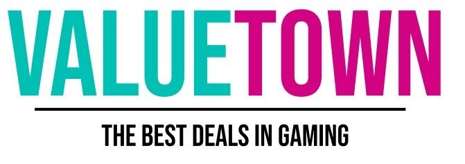

# Value Town

## Overview

**Value Town** is an online platform designed to facilitate the discovery and purchase of video games. It provides a seamless browsing experience, allowing users to explore various games, read detailed descriptions, and make informed purchasing decisions.

## Features

- Browse and search for games by title.
- View detailed game information.
- Access exclusive deals and discounts on selected titles.
- A user-friendly interface optimized for both desktop and mobile devices.

## Technologies

The application runs on Next.js with a vite compiler, Daisy UI and tailwind serve as the foundation for the design. The mongo DB uses Mongoose as orm for CRUD operations and modelling. The data is populated from [CheapShark API](https://apidocs.cheapshark.com) and enritched with data from [IGDB API](https://www.igdb.com/api)

## Getting Started

To get started with Value Town, follow these steps:

### Prerequisites

Ensure you have Node.js (version 12 or above) installed on your system.

### Installation

1. Clone the repository:
   git clone https://github.com/AntonJonsson94/GameStore

2. Navigate to the project directory:

`cd GameStore`

3. Install dependencies:

`npm install`

4. Copy `.env.example` to `.env` and fill in your MongoDB URI and other required environment variables.

5. Start the development server:

`npm run dev`

Your application will now be available at `http://localhost:3000`.

## Usage

Navigate to `http://localhost:3000` in your browser to start exploring GameStore. Use the search bar to find games, or navigate to one of the faetured deals on the landingpage.
